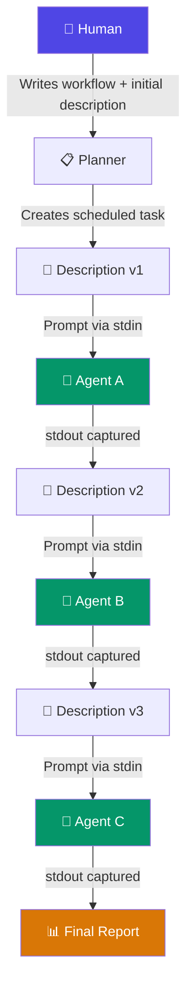
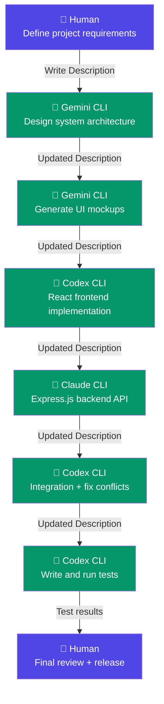

# ChronoFlow

[Tiếng Việt](./README.vi.md) · [Download](https://github.com/Enriah/ChronoFlow/releases/latest) · [Changelog](./CHANGELOG.md)


**ChronoFlow** is a local-first desktop application that coordinates humans and AI agents through scheduled, time-driven workflows. It started as a daily planner with timed events and focus sessions. It is now evolving into a workflow orchestration platform capable of sequencing multiple CLI-based AI agents—each with its own specialization—across a structured timeline.

Instead of manually opening different AI tools one by one, copying context between them, and deciding when each should run, ChronoFlow controls when each agent wakes up, receives its context, executes its task, and hands the project over to the next agent. The entire workflow is defined by the human, executed by AI, and coordinated by ChronoFlow—completely offline, completely local.

> **Current release:** `0.1.0` · Planner + Sessions + Visual Engine
> **In development:** Agent scheduling, workflow relay, automation engine

---

## Table of Contents

- [Project Overview](#project-overview)
- [Core Philosophy](#core-philosophy)
- [Quick Planner Language](#quick-planner-language)
- [AI Workflow Scheduling](#ai-workflow-scheduling)
- [Description-Driven Workflow](#description-driven-workflow)
- [AI Relay Pipeline](#ai-relay-pipeline)
- [Why ChronoFlow](#why-chronoflow)
- [Current Features](#current-features)
- [Example Workflow](#example-workflow)
- [Design Principles](#design-principles)
- [Future Vision](#future-vision)
- [Automation Engine](#automation-engine)
- [Roadmap](#roadmap)
- [Download](#download)
- [Development](#development)
- [Project Structure](#project-structure)
- [Creating a Release](#creating-a-release)
- [License](#license)

---

## Project Overview

ChronoFlow is not a simple calendar or reminder application. It is an **orchestration platform** for time-driven work—whether that work is done by a human, an AI agent, or both.

### What it does today

ChronoFlow provides a planner with timed event tracks, independent focus sessions, developer action automation, a reporting system, and a themeable visual engine—all running inside a single Tauri desktop application on Windows with no cloud dependency.

### Where it is going

ChronoFlow is becoming a system that can:

1. Accept a structured workflow definition from a human.
2. Schedule each task on a timeline with precise start times.
3. Launch the correct AI CLI agent for each task at the correct time.
4. Pass structured context (the **Description**) from one agent to the next.
5. Collect output, track completion, and activate the next step automatically.

The result is a **relay system**: the human designs the workflow once, and ChronoFlow executes it step by step—waking agents, feeding them context, collecting results, and moving forward.

```
 ┌──────────────────────────────────────────────────────────────┐
 │                     CHRONOFLOW RUNTIME                      │
 │                                                             │
 │   ┌─────────┐    ┌─────────┐    ┌─────────┐    ┌────────┐  │
 │   │ Agent A │───▶│ Agent B │───▶│ Agent C │───▶│ Report │  │
 │   │ (Design)│    │ (Build) │    │ (Test)  │    │        │  │
 │   └─────────┘    └─────────┘    └─────────┘    └────────┘  │
 │       ▲              │              │                       │
 │       │         Description    Description                  │
 │       │         (context)      (context)                    │
 │   Human input                                               │
 └──────────────────────────────────────────────────────────────┘
```

---

## Core Philosophy

ChronoFlow operates on six principles that separate it from general-purpose planners and AI chat interfaces:

| Principle | Explanation |
|---|---|
| **Human designs the workflow** | The human defines what happens, in what order, and which agent handles each task. AI never decides its own scope. |
| **AI agents execute specialized tasks** | Each agent is selected for what it does best. A code generator generates code. A tester runs tests. Roles are explicit. |
| **ChronoFlow coordinates everything** | The application manages timing, context passing, sequencing, and failure handling. No manual handoff required. |
| **Each agent focuses on one responsibility** | Agents receive a scoped Description and return a scoped result. They do not make architectural decisions or change the plan. |
| **No agent works randomly** | Every agent activation is triggered by the timeline. Nothing runs until its scheduled time arrives and its predecessor completes. |
| **Everything follows a timeline** | Time is the organizing principle. Tasks have start times, durations, and dependencies. The timeline is the source of truth. |

---

## Quick Planner Language

ChronoFlow includes a deterministic, local text parser that converts structured text into schedule blocks with timed events. No AI service or API key is used—the parser operates entirely through pattern matching.

### Syntax Modes

ChronoFlow supports two parser modes:

#### Mode 1 — Strict Inline Syntax

A single-line format for quick schedule creation.

```text
Day DD/MM/YYYY, from "HH:mm" to "HH:mm", "Schedule Title",
event(from "HH:mm" to "HH:mm", name "Event Name", <type> [options])
```

**Example:**

```text
Day 15/07/2026, from "09:00" to "11:00", "Morning Sprint",
event(from "09:00" to "09:15", name "Open IDE", action "VS Code"),
event(from "09:15" to "09:20", name "Review PRs", reminder),
event(from "09:30" to "10:00", name "Fix auth bug", note),
event(from "10:00" to "10:45", name "Write tests", checklist "unit tests|integration tests|coverage check"),
event(from "10:50" to "11:00", name "Standup reminder", alert)
```

**Keywords:**

| Keyword | Required | Description |
|---|---|---|
| `Day` | Yes | Date in `DD/MM/YYYY` format. Also accepts `Ngày` / `Ngay`. |
| `from ... to` | Yes | Schedule block start and end time in `HH:mm` or `HH:MM` format. Quoted or unquoted. |
| `"Title"` | Yes | Schedule block name. Must follow the time range. |
| `event(...)` | No | One or more timed events inside the block. |
| `name` | Yes (per event) | Event display name. Quoted. |
| `action` | — | Binds to a registered Developer Action by label or alias. |
| `reminder` | — | Standalone event type. Shows a popup at the scheduled time. |
| `checklist` | — | Pipe-separated checklist items: `"item1\|item2\|item3"`. |
| `note` | — | Standalone event type. Displays a note popup. |
| `alert` | — | Standalone event type. High-priority notification. |
| `project` | — | Optional project tag. |
| `tags` | — | Pipe-separated tags. |
| `priority` | — | `low`, `medium`, or `high`. |

#### Mode 2 — Block Syntax

A multi-line, structured format for complex schedules, sessions, and agent workflows.

```text
create task("Task Title") {
  date = 15_7_2026;
  time.begin = 20_30;
  duration = 90;
  description = "Implement authentication module";
  project = "MyApp";
  tags = "backend|security";
  priority = "high";

  create track("Development") {
    create event("Setup environment") {
      type = action;
      time.begin = 20_30;
      duration = 10;
      action = "VS Code";
    }
    create event("Run AI agent") {
      type = agent;
      agent = "Codex CLI";
      description = "Implement JWT auth middleware";
      timeout = 600;
      next.event = "Verify output";
      on.fail = retry;
    }
    create event("Verify output") {
      type = checklist;
      time.begin = 21_30;
      duration = 15;
      checklist = "code compiles|tests pass|no lint errors";
    }
  }
}
```

**Block syntax keywords:**

| Keyword | Context | Description |
|---|---|---|
| `create task(name) { }` | Top level | Defines a planner task block. |
| `create track(name) { }` | Inside task | Groups events into a named timeline track. |
| `create event(name) { }` | Inside track | Defines a timed event. |
| `create session(name) { }` | Top level | Defines a focus session with flow steps. |
| `create flow(name) { }` | Inside session | Defines a flow step. |
| `date` | Task / Session | Date as `DD_MM_YYYY` or `YYYY-MM-DD`. |
| `time.begin` | Task / Session / Event | Start time as `HH_MM` or `HH:MM`. |
| `duration` | Task / Session / Event | Duration in minutes. |
| `type` | Event | `action`, `agent`, `reminder`, `checklist`, `note`, `alert`, `flow_step`. |
| `agent` | Event (agent type) | Name of a registered AI agent profile. |
| `description` | Any | Free-text description. For agent events, this becomes the prompt. |
| `description.from` | Agent event | Set to `previous_output` to inherit context from the prior agent. |
| `next` / `next.event` | Agent event | Name of the event to activate after this agent completes. |
| `timeout` | Agent event | Maximum execution time in seconds. |
| `on.fail` | Agent event | Failure mode: `stop`, `retry`, `fallback`, or `manual`. |
| `require.approval` | Agent event | If `true`, ChronoFlow pauses for human approval before the next event. |
| `//` | Anywhere | Line comments. Ignored by the parser. |

### Parsing Rules

1. **Deterministic.** The parser uses pattern matching only. No AI, no network requests.
2. **Validation.** Dates are validated against the calendar. Times must have start before end. Events must fall within the parent schedule block.
3. **Overlap detection.** The parser warns if two events occupy the same time range.
4. **Action resolution.** Action labels are matched against the local Developer Action registry. Unresolved actions produce a warning, not an error.
5. **Agent resolution.** Agent names are matched against registered Agent Profiles. Unresolved agents produce a warning.
6. **Preview before commit.** Parse results are displayed in an editable confirmation view. Nothing is created until the user approves.

### Common Mistakes

| Mistake | Correction |
|---|---|
| Missing `Day` keyword | Always start with `Day DD/MM/YYYY` (inline) or `date = DD_MM_YYYY;` (block). |
| Event outside schedule range | Event `from/to` times must fall within the parent schedule block. |
| Missing event `name` | Every `event(...)` requires a `name "..."` field. |
| Missing event type | Specify `action`, `reminder`, `checklist`, `note`, or `alert`. |
| Using `MM/DD/YYYY` | The date format is `DD/MM/YYYY` (day first). |
| Unclosed parenthesis | Every `event(` must have a matching `)`. Every `{` must have a matching `}`. |

---

## AI Workflow Scheduling

This is the central capability that makes ChronoFlow more than a planner.

### How It Works

1. **Register agent profiles.** In Settings → AI Agents, add profiles for each CLI tool (Codex CLI, Claude CLI, Gemini CLI, or any CLI-based AI). Each profile specifies the command, arguments, working directory, timeout, and launch mode (`cli` for captured output, `app` for GUI launch).

2. **Create a scheduled task with agent events.** Using the Block Planner Language, define a task with `type = agent` events. Each event references a registered agent profile by name.

3. **ChronoFlow executes the timeline.** When the scheduled time arrives, ChronoFlow launches the agent process, pipes the Description as the prompt through stdin (CLI mode) or writes it to a prompt file (app mode), waits for completion or timeout, captures stdout/stderr, records the run, and activates the next event.

### Example: Scheduled Agent Task

```text
create task("Build Login Page") {
  date = 15_7_2026;
  time.begin = 14_00;
  duration = 120;
  project = "WebApp";

  create track("AI Pipeline") {

    // Step 1: Generate UI component
    create event("Generate UI") {
      type = agent;
      agent = "Gemini CLI";
      description = "Create a React login page component with email/password fields, validation, and responsive design. Use TypeScript and CSS modules.";
      timeout = 300;
      next.event = "Implement backend";
      on.fail = manual;
    }

    // Step 2: Implement backend API
    create event("Implement backend") {
      type = agent;
      agent = "Codex CLI";
      description.from = previous_output;
      description.append = "Now implement the Express.js authentication API endpoint that this login page will call.";
      timeout = 300;
      next.event = "Review code";
      on.fail = retry;
    }

    // Step 3: Human review checkpoint
    create event("Review code") {
      type = checklist;
      time.begin = 15_30;
      duration = 20;
      checklist = "UI renders correctly|API returns JWT|Error handling works|No TypeScript errors";
    }
  }
}
```

**What happens at runtime:**

1. At `14:00`, ChronoFlow launches `Gemini CLI` with the description as the prompt.
2. Gemini CLI completes. Its output is captured and stored.
3. ChronoFlow activates `"Implement backend"`. Because `description.from = previous_output`, the output from Step 1 becomes the context for Step 2, with `description.append` text added.
4. Codex CLI completes. Output is captured.
5. At `15:30`, ChronoFlow shows the human review checklist. The human verifies each item before the workflow is marked complete.

Each task inherits context from previous tasks automatically through the Description relay mechanism.

---

## Description-Driven Workflow

Every Schedule item in ChronoFlow contains a **Description** field. In the agent workflow model, the Description serves a dual purpose:

1. **Instruction file.** The Description tells the next agent what to do, what has been done, and what constraints apply.
2. **Communication channel.** When an agent completes, its output can become the Description for the next agent in the chain.

### The Description Lifecycle

```
┌─────────────────┐
│  Human writes    │
│  initial         │
│  Description     │
└────────┬────────┘
         │
         ▼
┌─────────────────┐
│  Agent A reads   │
│  Description     │
│  Executes task   │
│  Produces output │
└────────┬────────┘
         │
         ▼
┌─────────────────┐
│  ChronoFlow      │
│  captures output │
│  Updates          │
│  Description     │
└────────┬────────┘
         │
         ▼
┌─────────────────┐
│  Agent B reads   │
│  updated         │
│  Description     │
│  Executes task   │
│  Produces output │
└────────┬────────┘
         │
         ▼
       (repeat)
```

### How Description Relay Works

| Agent Event Field | Effect |
|---|---|
| `description = "..."` | Static prompt. The agent receives this exact text. |
| `description.from = previous_output` | Dynamic prompt. The agent receives the stdout of the previous agent. |
| `description.append = "..."` | Appended to whatever description source is used. Adds task-specific instructions. |
| `write.output = "path"` | Writes agent output to a file in addition to storing it in the run log. |

The Description is the **single structured document** that flows through the entire pipeline. Each agent reads it, acts on it, and produces an updated version. ChronoFlow manages the flow.

---

## AI Relay Pipeline

The full relay pipeline visualized:



### Key Properties

- **Description is the communication channel.** Agents do not communicate directly with each other. All context flows through the Description, which ChronoFlow manages.
- **Each agent is stateless.** An agent receives a prompt, produces output, and exits. It has no memory of previous runs unless the Description provides that context.
- **ChronoFlow is the state manager.** Run history, output logs, Description versions, and workflow progression are all tracked by ChronoFlow.
- **Human can intervene at any point.** The `require.approval` flag pauses the pipeline for human review before activating the next agent.

---

## Why ChronoFlow

| Capability | Normal Planner | ChronoFlow |
|---|---|---|
| **Audience** | Reminds humans | Coordinates humans **and** AI agents |
| **Data model** | Stores tasks | Stores tasks, agent profiles, run logs, and workflow state |
| **Behavior** | Passive: displays information | Active: launches processes, captures output, relays context |
| **Automation** | Sends notifications | Executes CLI commands, manages agent lifecycles |
| **Context passing** | None | Description relay between sequential agents |
| **Workflow control** | None | Time-driven sequencing with failure modes and approval gates |
| **AI dependency** | Requires specific AI platform | Works with **any** CLI-based AI tool |
| **Data location** | Often cloud-synced | Entirely local |

---

## Current Features

The 0.1.0 release provides the foundation that the orchestration system builds on.

| Area | Purpose |
|---|---|
| **Schedule** | Shows today's running plan. EventTrack occupies the main area while Today's Timeline remains a compact reference panel. |
| **Planner** | Creates and edits dated schedule blocks and their Event Timeline. Today's Planner items synchronize into Schedule automatically. |
| **Sessions** | Runs a standalone focus timer with flow steps, checklists, notes, interruptions, and approved actions. Sessions are independent from Schedule. |
| **Session Templates** | Stores reusable Session setups: duration, actions, flow steps, and notes. A template never creates a Planner or Schedule item by itself. |
| **Reports** | Calculates real metrics only from completed Sessions, including focused time, project totals, planned vs. actual time, and recent sessions. |
| **AI Agents** | Registers CLI agent profiles (command, args, working directory, timeout). Agent events in timelines can launch agents and capture output. |
| **Themes** | Applies complete theme palettes, backgrounds, typography, widget surfaces, and Visual Engine effects. |
| **Settings** | Manages approved developer actions, timer sounds, floating widget options, and local backup/restore. |

### Themes and Visual Effects

ChronoFlow includes Minimal Dark, Cyber Dev, Terminal, Sakura Day, Enchanted Realm, Maple Forest, Sakura Evening, and Deep Galaxy themes. Available Canvas Visual Engine effects include aurora, electricity, fog, maple leaves, matrix rain, rain, sakura petals, snow, and stars.

The effect layer is rendered above the background and below application widgets. Effect colors adapt to light and dark palettes so particles remain visible without reducing widget readability.

### Quick Start

#### 1. Register an action (optional)

Open **Settings → Developer Actions → Add Action**. Choose an app, file, folder, URL, or command, then set whether it is enabled and whether ChronoFlow must ask before launching it. Command actions always require confirmation and receive a safety classification.

Only registered and enabled actions can be bound to timeline events. This prevents schedule text from becoming an unrestricted command runner.

#### 2. Plan a day

Open **Planner**, choose a date, and create a schedule block. Set its title, start time, duration, and Event Timeline. Duration accepts any minute value; values below five minutes are normalized to five.

Timeline events may be actions, agents, reminders, checklist groups, notes, or alerts. Events are placed relative to the schedule block and can be arranged on separate tracks.

#### 3. Create a plan from text

Use **Quick Add** in Planner to parse a deterministic local command. No AI service or API key is used.

```text
Day 06/07/2026, from "09:30" to "10:30", "Fix CI Pipeline",
event(from "09:45" to "09:50", name "Open Chrome", action "Chrome"),
event(from "10:00" to "10:05", name "Check logs", reminder),
event(from "10:15" to "10:25", name "Verify", checklist "check health|check logs|check dashboard")
```

The parser validates dates and times, detects overlaps or out-of-range events, resolves enabled actions, and presents an editable preview before anything is created.

#### 4. Follow today's plan

Items dated today appear in **Schedule**. EventTrack displays the events from those items and triggers bound actions at their configured times. The compact panel on the right shows the day's chronological blocks.

#### 5. Run an independent Session

Open **Sessions → New session** to create a manual focus session. Add flow steps, checklists, notes, and actions, then start the timer. Save useful setups as Session Templates for reuse. Completed sessions become the source of truth for Reports.

---

## Example Workflow

A complete real-world project built through ChronoFlow's relay pipeline:



### Step-by-Step Transitions

| Step | Agent | Task | Context Source |
|---|---|---|---|
| 1 | Human | Write project requirements, tech stack, constraints | — |
| 2 | Gemini CLI | Design system architecture and component breakdown | Human's Description |
| 3 | Gemini CLI | Generate detailed UI component specifications | Architecture output |
| 4 | Codex CLI | Implement React frontend from UI specifications | UI spec output |
| 5 | Claude CLI | Implement backend API endpoints matching frontend contracts | Frontend output |
| 6 | Codex CLI | Integrate frontend and backend, resolve type mismatches | Backend + frontend output |
| 7 | Codex CLI | Write test suites and run them, report results | Integrated codebase output |
| 8 | Human | Review test results, approve or request changes | Test results |

**Why different agents?** Each agent is chosen for its strength. Gemini for design reasoning, Codex for fast code execution with local sandbox, Claude for API design. ChronoFlow does not care which AI is used—it only needs a CLI command that reads stdin and writes stdout.

### Planner Language for This Workflow

```text
create task("Build E-Commerce App") {
  date = 15_7_2026;
  time.begin = 9_00;
  duration = 480;          // 8-hour workday
  project = "E-Commerce";
  priority = "high";

  create track("AI Pipeline") {
    create event("Design architecture") {
      type = agent;
      agent = "Gemini CLI";
      description = "Design the system architecture for an e-commerce app with: product catalog, shopping cart, checkout, user auth. Use React + Express + PostgreSQL. Output component tree and API contract.";
      timeout = 300;
      next.event = "Generate UI specs";
    }
    create event("Generate UI specs") {
      type = agent;
      agent = "Gemini CLI";
      description.from = previous_output;
      description.append = "Generate detailed UI component specifications for each page. Include props, state, and layout.";
      timeout = 300;
      next.event = "Build frontend";
    }
    create event("Build frontend") {
      type = agent;
      agent = "Codex CLI";
      description.from = previous_output;
      description.append = "Implement the React frontend. Create all components, pages, routing, and state management.";
      timeout = 600;
      next.event = "Build backend";
    }
    create event("Build backend") {
      type = agent;
      agent = "Claude CLI";
      description.from = previous_output;
      description.append = "Implement the Express.js backend API. Create all endpoints matching the frontend API contract.";
      timeout = 600;
      next.event = "Integration";
    }
    create event("Integration") {
      type = agent;
      agent = "Codex CLI";
      description.from = previous_output;
      description.append = "Integrate frontend and backend. Fix any type mismatches, update API calls, resolve import errors.";
      timeout = 300;
      next.event = "Testing";
    }
    create event("Testing") {
      type = agent;
      agent = "Codex CLI";
      description.from = previous_output;
      description.append = "Write and run unit tests and integration tests. Report pass/fail status for all test suites.";
      timeout = 300;
      next.event = "Final review";
      require.approval = true;
    }
    create event("Final review") {
      type = checklist;
      time.begin = 16_00;
      duration = 30;
      checklist = "All tests pass|No TypeScript errors|API contracts match|UI renders correctly|Auth flow works";
    }
  }
}
```

---

## Design Principles

| Principle | Description |
|---|---|
| **Local First** | All data stays on the device. No cloud account, no telemetry, no external dependencies at runtime. Backup and restore are file-based. |
| **Transparent Workflow** | Every agent run is logged with full stdout/stderr capture. The user can inspect what each agent received and what it produced. |
| **Human Approval** | Critical transitions can require explicit human approval before the next agent is activated. The human is always in control. |
| **Modular Agents** | Agents are registered as profiles with a command and arguments. Adding a new agent takes seconds. Removing one does not break the workflow. |
| **Time-Driven Automation** | The timeline is the execution engine. Tasks activate at their scheduled time. No polling, no manual triggers. |
| **Replaceable AI** | ChronoFlow treats AI agents as interchangeable CLI processes. Swap Codex for Claude, Claude for Gemini, or any future tool. The workflow definition stays the same. |
| **Extensible Architecture** | The planner language, event types, agent configuration, and automation rules are designed to grow without breaking existing workflows. |

---

## Future Vision

ChronoFlow aims to become a **universal AI workflow orchestrator**. The long-term goal is a system where any CLI-based AI tool can be plugged in and coordinated through scheduled, description-driven workflows.

### Agent Ecosystem

Future agent profiles could include specialized roles across different domains:

| Domain | Possible Agents |
|---|---|
| **Software Development** | Frontend Engineer, Backend Engineer, DevOps, QA Tester, Code Reviewer |
| **Design** | UI Designer, UX Researcher, 3D Artist, Image Generator |
| **Content** | Technical Writer, Documentation Generator, Translator |
| **Media** | Music Generator, Sound Designer, Video Generator, Voice Synthesizer |
| **Operations** | Deployment Agent, Monitoring Agent, Incident Responder |

### Provider Independence

ChronoFlow should work with **any** CLI-based AI:

- OpenAI Codex CLI
- Anthropic Claude CLI
- Google Gemini CLI
- Local models via Ollama, llama.cpp, or LM Studio
- Custom scripts and toolchains
- Future tools that do not exist yet

ChronoFlow never depends on one specific provider. The agent profile system is a thin adapter: a name, a command, arguments, and a timeout. If a tool reads stdin and writes stdout, it can be a ChronoFlow agent.

---

## Automation Engine

Future releases will introduce an **automation engine** that extends the timeline with event-driven triggers. Instead of only time-based activation, tasks can wait for external conditions before proceeding.

### Planned Trigger Types

| Trigger | Behavior |
|---|---|
| `wait_process_exit` | Activate the next task when a specific process exits. |
| `wait_command_zero` | Run a command periodically; activate when it returns exit code `0`. |
| `wait_folder_change` | Watch a directory for file creation or modification. |
| `wait_markdown_update` | Activate when a specific `.md` file is modified (useful for Description relay). |
| `wait_build_finish` | Monitor a build command; activate when it completes successfully. |
| `wait_tests_pass` | Run a test suite; activate when all tests pass. |
| `wait_quota_reset` | Wait for an API rate limit to reset before launching the next agent. |
| `wait_window_close` | Activate when a specific application window is closed. |

### Example: Build-Then-Test Automation

```text
create event("Run build") {
  type = agent;
  agent = "Codex CLI";
  description = "Build the project with npm run build. Report any errors.";
  next.event = "Run tests";
}

// Future syntax (planned)
create event("Run tests") {
  type = agent;
  agent = "Codex CLI";
  trigger = wait_build_finish("npm run build");
  description.from = previous_output;
  description.append = "Run all test suites. Report results.";
}
```

These triggers transform ChronoFlow from a time-only scheduler into a reactive automation system that responds to real-world events.

---

## Roadmap

| Version | Milestone | Status |
|---|---|---|
| **0.1** | Planner, Sessions, Visual Engine, Developer Actions, Themes | ✅ Released |
| **0.2** | Quick Planner Language (Strict + Block syntax) | 🔧 In progress |
| **0.3** | Workflow Scheduling — Agent timeline events with context relay | 🔧 In progress |
| **0.4** | CLI Automation — Captured agent runs, stdout/stderr logging | Planned |
| **0.5** | Description Relay — Automatic `previous_output` context passing | Planned |
| **0.6** | Universal AI Adapter — Profile system for any CLI-based AI | Planned |
| **0.7** | Parallel Workflow — Multiple agents running concurrently on separate tracks | Planned |
| **0.8** | Conditional Workflow — Branch the pipeline based on agent output or exit code | Planned |
| **0.9** | Automation Rules — File watchers, process monitors, trigger conditions | Planned |
| **1.0** | **AI Studio Orchestrator** — Full orchestration platform with visual workflow editor | Planned |

---

## Download

The current desktop release is **ChronoFlow 0.1.0** for Windows 10/11 x64.

- [Download the recommended Windows installer (.exe)](https://github.com/Enriah/ChronoFlow/releases/latest/download/ChronoFlow_0.1.0_x64-setup.exe)
- [Download the Windows Installer package (.msi)](https://github.com/Enriah/ChronoFlow/releases/latest/download/ChronoFlow_0.1.0_x64_en-US.msi)
- [Open all releases and release notes](https://github.com/Enriah/ChronoFlow/releases)

Run one installer, complete the setup wizard, and open ChronoFlow from the Start menu. Windows SmartScreen may show an unrecognized-publisher warning because the community build is not code-signed; verify that the file comes from this repository's Releases page before continuing.

---

## Local Data and Privacy

ChronoFlow is local-first. Schedules, Planner items, Sessions, templates, actions, agent profiles, agent run logs, theme settings, and widget settings are stored on the device. The app does not require an account and the current production build has no AI Companion or cloud-memory subsystem.

Use **Settings → Data / Backup** to export a backup before reinstalling or moving to another machine, and import that backup to restore supported application data.

---

## Development

### Requirements

- Node.js 22 LTS or newer
- pnpm 10
- Rust stable through [rustup](https://rustup.rs/)
- Microsoft C++ Build Tools and WebView2 on Windows

### Install and run

```bash
git clone https://github.com/Enriah/ChronoFlow.git
cd ChronoFlow
pnpm install
pnpm tauri dev
```

### Verify and build

```bash
pnpm lint
pnpm build
cargo check --manifest-path src-tauri/Cargo.toml
pnpm tauri build
```

Windows packages are generated under:

```text
src-tauri/target/release/bundle/msi/
src-tauri/target/release/bundle/nsis/
```

---

## Project Structure

```text
src/
  components/               Shared application UI and settings
  core/                     Session and domain-level state
  features/
    agents/                 AI agent profile registry and run log viewer
    automation/             Automation engine (planned)
    developer-actions/      Approved action registry
    event-timeline/         Timeline editor and runtime controllers
    quick-planner/          Strict + Block local text parsers and preview
    schedule/               Today's EventTrack
    sessions/               Session editor and timer runtime
    session-templates/      Reusable manual-session templates
  models/                   Persisted TypeScript domain models
  services/                 Audio, persistence, scheduling, actions, widgets
  store/                    Zustand application stores
  themes/                   Theme definitions and provider
  visual-engine/            Canvas renderer and isolated effect modules
  widgets/                  Planner, timeline, floating and styled widgets
src-tauri/
  capabilities/             Tauri v2 permissions
  src/                      Native Rust commands
.github/workflows/          Reproducible GitHub Release build
```

---

## Creating a Release

The `release.yml` workflow builds Windows installers and publishes them to GitHub Releases whenever a version tag is pushed:

```bash
git tag -a v0.1.0 -m "ChronoFlow 0.1.0"
git push origin v0.1.0
```

Keep the tag synchronized with `src-tauri/tauri.conf.json`. Release files are generated by GitHub Actions and should not be committed to Git.

---

## License

ChronoFlow is available under the [MIT License](./LICENSE).

---

<p align="center">
  <strong>ChronoFlow</strong> · Human designs. AI executes. Time orchestrates.
</p>
