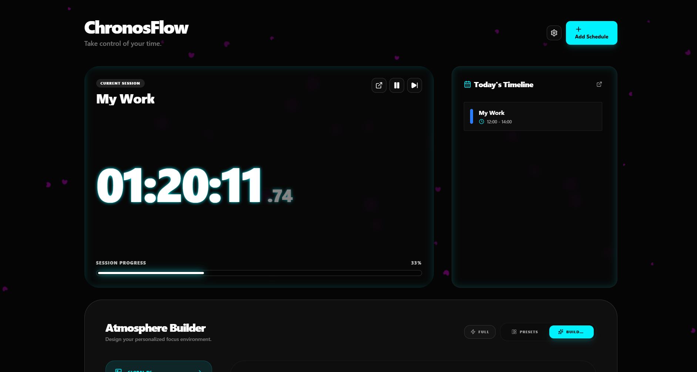

# ChronoFlow

ChronoFlow is a next-generation schedule and task management application designed for focus and immersion. Built with a powerful visual engine and a highly customizable UI, it transforms your daily routine into a personalized, atmospheric experience.



## ✨ Key Features

### 🌌 Immersive Atmosphere Builder
Design your perfect workspace with dynamic background effects. Choose from **Rain, Sakura, Snow, Stars, Matrix, Electricity, and Fog**. Control every detail from intensity and speed to opacity, ensuring your environment matches your flow state.

### 🎨 Total UI Customization
Tailor every widget to your aesthetic. Chronoflow supports **Glassmorphism, Gradients, and Custom Image backgrounds** for all UI elements. Tweak corner radii, blur depth, inner glows, and shadow intensities to create a truly unique desktop presence.

### 📅 Advanced Scheduling & Planning
- **Smart Timeline:** Visualize your day with an interactive timeline that syncs in real-time.
- **Integrated Planner:** Plan ahead with a full calendar view, categories, and progress tracking.
- **Linked Actions:** Automatically open URLs, applications, or folders when a task starts to streamline your workflow.

### 🎵 Intelligent Audio Engine
Never miss a transition with a granular notification system. Assign custom sounds to events like "Task Started" or "Session Ending," and manage global volumes for a non-intrusive focus experience.

### 📊 Productivity Insights
Track your progress with weekly focus statistics and activity rankings. Understand where your time goes and optimize your habits over time.

## 🚀 Tech Stack

- **Frontend:** React 19 + TypeScript + Vite
- **Desktop Framework:** Tauri v2 (Rust)
- **Styling:** Tailwind CSS 4.0
- **State Management:** Zustand
- **Icons:** Lucide React
- **Date Handling:** date-fns

## 🛠️ Developer Setup Guide

### Prerequisites
- **Node.js:** Latest LTS version.
- **Rust:** Required for building Tauri applications. Install at [rustup.rs](https://rustup.rs/).
- **pnpm:** Recommended package manager.

### Steps
1. **Clone the repository:**
   ```bash
   git clone <repository-url>
   cd ScheduleApp
   ```

2. **Install dependencies:**
   ```bash
   pnpm install
   ```

3. **Run in development mode:**
   ```bash
   pnpm tauri dev
   ```

4. **Build the application:**
   ```bash
   pnpm tauri build
   ```

## 🧩 Modding Guide

"Modding" in this project refers to extending or modifying core features. Here is a basic overview:

### Important Directory Structure
- `src/components/`: Contains UI components. You can add new widgets here.
- `src/store/`: State management via Zustand. Create a `use...Store.ts` file here for new storage logic.
- `src/models/`: Interfaces and data types for schedules and tasks.
- `src/hooks/`: Custom hooks for logic like session tracking and notifications.

### Adding New Features
1. **Define Models:** If the new feature requires new data structures, update or add files in `src/models/`.
2. **Manage State:** Update the corresponding store in `src/store/` to handle data logic.
3. **Create UI:** Build new components in `src/components/` and integrate them into `Dashboard.tsx` or relevant views.

## 🎨 Theme Customization Guide

The project features a flexible theme system. You can easily add new themes following these steps:

### 1. Define a New Theme
Open `src/themes/configs.ts` and create a new `ThemeConfig` object. Example:

```typescript
export const myCustomTheme: ThemeConfig = {
  id: 'my-custom',
  name: 'My Custom Theme',
  type: 'custom',
  colors: {
    background: '#1a1a1a',
    surface: '#2d2d2d',
    surfaceHover: '#3d3d3d',
    primary: '#ff5555',
    primaryForeground: '#ffffff',
    text: '#f8f8f2',
    textSecondary: '#6272a4',
    border: '#44475a',
    accent: '#bd93f9',
  },
  typography: {
    fontFamily: 'Inter, sans-serif',
    titleFont: 'Inter, sans-serif',
  },
  ui: {
    radius: '8px',
    borderWeight: '1px',
    shadow: '0 4px 12px rgba(0,0,0,0.5)',
  },
  effects: {
    glow: true,
    scanlines: false,
    animations: true,
    // Particle effect colors
    rainColor: 'rgba(255, 85, 85, 0.3)',
    snowColor: 'rgba(255, 255, 255, 0.5)',
    sakuraColor: 'rgba(255, 183, 197, 0.5)',
    starsColor: 'rgba(189, 147, 249, 0.6)',
    matrixColor: 'rgba(80, 250, 123, 0.8)',
    electricityColor: 'rgba(139, 233, 253, 0.8)',
    fogColor: 'rgba(68, 71, 90, 0.2)',
  },
};
```

### 2. Register the Theme
Add your newly created theme to the `themes` array at the end of `src/themes/configs.ts`:

```typescript
export const themes = [
  minimalTheme, 
  neonTheme, 
  terminalTheme, 
  softTheme, 
  fantasyTheme,
  myCustomTheme // Add it here
];
```

### 3. Update Types (If necessary)
If you use a new `type`, update the `ThemeType` union in `src/themes/theme.types.ts`.

## 📄 License

This project is distributed under the **MIT** License. See the `LICENSE` file for more details.
