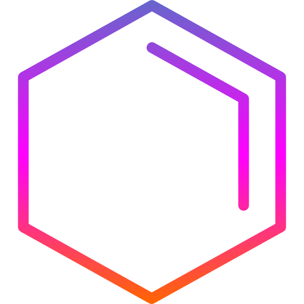
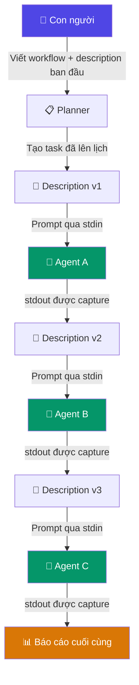
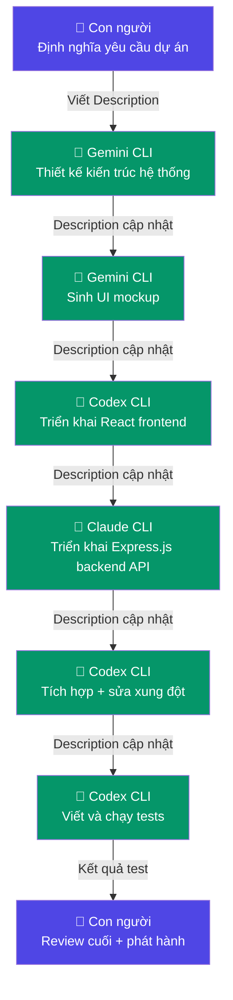

# ChronoFlow

[English](./README.md) · [Tải bản mới nhất](https://github.com/Enriah/ChronoFlow/releases/latest) · [Lịch sử thay đổi](./CHANGELOG.md)



**ChronoFlow** là ứng dụng desktop hoạt động theo hướng local-first, điều phối con người và các AI agent thông qua workflow theo lịch trình và dòng thời gian. Khởi đầu là một planner hàng ngày với event có thời gian cụ thể và phiên tập trung, ChronoFlow đang phát triển thành một **nền tảng điều phối workflow** có khả năng sắp xếp nhiều AI CLI agent—mỗi agent có chuyên môn riêng—trên một timeline có cấu trúc.

Thay vì phải mở từng công cụ AI một cách thủ công, sao chép context giữa chúng và tự quyết định khi nào mỗi công cụ nên chạy, ChronoFlow kiểm soát khi nào mỗi agent thức dậy, nhận context, thực thi nhiệm vụ và bàn giao dự án cho agent tiếp theo. Toàn bộ workflow được con người thiết kế, AI thực thi và ChronoFlow điều phối—hoàn toàn offline, hoàn toàn local.

> **Phiên bản hiện tại:** `0.1.0` · Planner + Sessions + Visual Engine
> **Đang phát triển:** Agent scheduling, workflow relay, automation engine

---

## Mục lục

- [Tổng quan dự án](#tổng-quan-dự-án)
- [Triết lý cốt lõi](#triết-lý-cốt-lõi)
- [Ngôn ngữ Quick Planner](#ngôn-ngữ-quick-planner)
- [Lập lịch workflow AI](#lập-lịch-workflow-ai)
- [Workflow theo Description](#workflow-theo-description)
- [Hệ thống chuyển tiếp AI](#hệ-thống-chuyển-tiếp-ai)
- [Tại sao ChronoFlow](#tại-sao-chronoflow)
- [Tính năng hiện tại](#tính-năng-hiện-tại)
- [Ví dụ workflow hoàn chỉnh](#ví-dụ-workflow-hoàn-chỉnh)
- [Nguyên tắc thiết kế](#nguyên-tắc-thiết-kế)
- [Tầm nhìn tương lai](#tầm-nhìn-tương-lai)
- [Automation Engine](#automation-engine)
- [Lộ trình phát triển](#lộ-trình-phát-triển)
- [Tải và cài đặt](#tải-và-cài-đặt)
- [Dành cho nhà phát triển](#dành-cho-nhà-phát-triển)
- [Cấu trúc dự án](#cấu-trúc-dự-án)
- [Tạo release](#tạo-release)
- [Giấy phép](#giấy-phép)

---

## Tổng quan dự án

ChronoFlow không phải là ứng dụng lịch hay nhắc nhở đơn giản. Đây là một **nền tảng điều phối** cho công việc theo thời gian—dù công việc đó do con người, AI agent, hay cả hai thực hiện.

### Hiện tại ChronoFlow làm được gì

ChronoFlow cung cấp planner với event track có thời gian, phiên tập trung độc lập, tự động hóa developer action, hệ thống báo cáo và visual engine có thể tùy chỉnh theme—tất cả chạy trong một ứng dụng Tauri trên Windows, không phụ thuộc cloud.

### Hướng đi tiếp theo

ChronoFlow đang trở thành hệ thống có khả năng:

1. Nhận workflow có cấu trúc từ người dùng.
2. Lên lịch từng nhiệm vụ trên timeline với thời điểm bắt đầu chính xác.
3. Khởi chạy đúng AI CLI agent cho từng nhiệm vụ vào đúng thời điểm.
4. Truyền context có cấu trúc (**Description**) từ agent này sang agent tiếp theo.
5. Thu thập kết quả, theo dõi hoàn thành và kích hoạt bước tiếp theo tự động.

Kết quả là một **hệ thống chuyển tiếp**: người dùng thiết kế workflow một lần, và ChronoFlow thực thi từng bước—đánh thức agent, truyền context, thu thập kết quả và tiến lên.

```
 ┌──────────────────────────────────────────────────────────────┐
 │                     CHRONOFLOW RUNTIME                      │
 │                                                             │
 │   ┌─────────┐    ┌─────────┐    ┌─────────┐    ┌────────┐  │
 │   │ Agent A │───▶│ Agent B │───▶│ Agent C │───▶│ Report │  │
 │   │(Thiết kế)│   │ (Build) │    │ (Test)  │    │        │  │
 │   └─────────┘    └─────────┘    └─────────┘    └────────┘  │
 │       ▲              │              │                       │
 │       │         Description    Description                  │
 │       │         (context)      (context)                    │
 │   Input từ                                                  │
 │   con người                                                 │
 └──────────────────────────────────────────────────────────────┘
```

---

## Triết lý cốt lõi

ChronoFlow hoạt động trên sáu nguyên tắc tách biệt nó khỏi các planner thông thường và giao diện chat AI:

| Nguyên tắc | Giải thích |
|---|---|
| **Con người thiết kế workflow** | Con người định nghĩa điều gì xảy ra, theo thứ tự nào và agent nào xử lý từng nhiệm vụ. AI không bao giờ tự quyết định phạm vi của mình. |
| **AI agent thực thi nhiệm vụ chuyên biệt** | Mỗi agent được chọn dựa trên thế mạnh. Bộ sinh code thì sinh code. Bộ test thì chạy test. Vai trò được chỉ định rõ ràng. |
| **ChronoFlow điều phối mọi thứ** | Ứng dụng quản lý thời gian, truyền context, tuần tự hóa và xử lý lỗi. Không cần bàn giao thủ công. |
| **Mỗi agent tập trung vào một trách nhiệm** | Agent nhận Description có phạm vi cụ thể và trả về kết quả có phạm vi cụ thể. Agent không đưa ra quyết định kiến trúc hay thay đổi kế hoạch. |
| **Không agent nào chạy ngẫu nhiên** | Mọi kích hoạt agent đều được kích hoạt bởi timeline. Không gì chạy cho đến khi đến thời gian được lên lịch và bước trước đó hoàn thành. |
| **Mọi thứ tuân theo dòng thời gian** | Thời gian là nguyên tắc tổ chức. Nhiệm vụ có thời gian bắt đầu, thời lượng và phụ thuộc. Timeline là nguồn sự thật duy nhất. |

---

## Ngôn ngữ Quick Planner

ChronoFlow tích hợp bộ parser text cục bộ, xác định, chuyển đổi văn bản có cấu trúc thành các khối lịch với event có thời gian. Không sử dụng dịch vụ AI hay API key—parser hoạt động hoàn toàn thông qua pattern matching.

### Các chế độ cú pháp

ChronoFlow hỗ trợ hai chế độ parser:

#### Chế độ 1 — Cú pháp inline ngắn gọn

Định dạng một dòng để tạo lịch nhanh.

```text
Day DD/MM/YYYY, from "HH:mm" to "HH:mm", "Tên Schedule",
event(from "HH:mm" to "HH:mm", name "Tên Event", <loại> [tùy chọn])
```

**Ví dụ:**

```text
Day 15/07/2026, from "09:00" to "11:00", "Sprint buổi sáng",
event(from "09:00" to "09:15", name "Mở IDE", action "VS Code"),
event(from "09:15" to "09:20", name "Review PR", reminder),
event(from "09:30" to "10:00", name "Fix auth bug", note),
event(from "10:00" to "10:45", name "Viết test", checklist "unit tests|integration tests|coverage check"),
event(from "10:50" to "11:00", name "Nhắc standup", alert)
```

**Từ khóa:**

| Từ khóa | Bắt buộc | Mô tả |
|---|---|---|
| `Day` | Có | Ngày theo định dạng `DD/MM/YYYY`. Cũng chấp nhận `Ngày` / `Ngay`. |
| `from ... to` | Có | Thời gian bắt đầu và kết thúc schedule block, định dạng `HH:mm` hoặc `HH:MM`. Có hoặc không có dấu ngoặc kép. |
| `"Tên"` | Có | Tên schedule block. Phải đặt sau khoảng thời gian. |
| `event(...)` | Không | Một hoặc nhiều event có thời gian trong block. |
| `name` | Có (mỗi event) | Tên hiển thị của event. Đặt trong ngoặc kép. |
| `action` | — | Liên kết với Developer Action đã đăng ký theo label hoặc alias. |
| `reminder` | — | Loại event độc lập. Hiển thị popup khi đến giờ. |
| `checklist` | — | Danh sách mục phân tách bằng dấu pipe: `"mục1\|mục2\|mục3"`. |
| `note` | — | Loại event độc lập. Hiển thị popup ghi chú. |
| `alert` | — | Loại event độc lập. Thông báo ưu tiên cao. |
| `project` | — | Tag dự án tùy chọn. |
| `tags` | — | Các tag phân tách bằng dấu pipe. |
| `priority` | — | `low`, `medium`, hoặc `high`. |

#### Chế độ 2 — Cú pháp block

Định dạng nhiều dòng, có cấu trúc cho lịch phức tạp, session và workflow agent.

```text
create task("Tên Task") {
  date = 15_7_2026;
  time.begin = 20_30;
  duration = 90;
  description = "Triển khai module xác thực";
  project = "MyApp";
  tags = "backend|security";
  priority = "high";

  create track("Development") {
    create event("Setup environment") {
      type = action;
      time.begin = 20_30;
      duration = 10;
      action = "VS Code";
    }
    create event("Chạy AI agent") {
      type = agent;
      agent = "Codex CLI";
      description = "Triển khai JWT auth middleware";
      timeout = 600;
      next.event = "Kiểm tra kết quả";
      on.fail = retry;
    }
    create event("Kiểm tra kết quả") {
      type = checklist;
      time.begin = 21_30;
      duration = 15;
      checklist = "code biên dịch được|tests pass|không có lỗi lint";
    }
  }
}
```

**Từ khóa cú pháp block:**

| Từ khóa | Ngữ cảnh | Mô tả |
|---|---|---|
| `create task(tên) { }` | Cấp cao nhất | Định nghĩa khối task trong planner. |
| `create track(tên) { }` | Trong task | Nhóm các event vào một track timeline được đặt tên. |
| `create event(tên) { }` | Trong track | Định nghĩa event có thời gian. |
| `create session(tên) { }` | Cấp cao nhất | Định nghĩa phiên tập trung với flow step. |
| `create flow(tên) { }` | Trong session | Định nghĩa flow step. |
| `date` | Task / Session | Ngày dạng `DD_MM_YYYY` hoặc `YYYY-MM-DD`. |
| `time.begin` | Task / Session / Event | Thời gian bắt đầu dạng `HH_MM` hoặc `HH:MM`. |
| `duration` | Task / Session / Event | Thời lượng tính bằng phút. |
| `type` | Event | `action`, `agent`, `reminder`, `checklist`, `note`, `alert`, `flow_step`. |
| `agent` | Event (loại agent) | Tên agent profile đã đăng ký. |
| `description` | Bất kỳ | Mô tả tự do. Với event agent, đây là prompt. |
| `description.from` | Event agent | Đặt `previous_output` để kế thừa context từ agent trước. |
| `next` / `next.event` | Event agent | Tên event cần kích hoạt sau khi agent này hoàn thành. |
| `timeout` | Event agent | Thời gian thực thi tối đa tính bằng giây. |
| `on.fail` | Event agent | Chế độ xử lý lỗi: `stop`, `retry`, `fallback`, hoặc `manual`. |
| `require.approval` | Event agent | Nếu `true`, ChronoFlow tạm dừng chờ duyệt thủ công trước event tiếp theo. |
| `//` | Bất kỳ đâu | Comment dòng. Parser bỏ qua. |

### Quy tắc phân tích

1. **Xác định (deterministic).** Parser chỉ dùng pattern matching. Không AI, không gọi mạng.
2. **Validation.** Ngày được kiểm tra theo lịch. Thời gian phải có bắt đầu trước kết thúc. Event phải nằm trong schedule block cha.
3. **Phát hiện chồng lấp.** Parser cảnh báo nếu hai event chiếm cùng khoảng thời gian.
4. **Phân giải action.** Label action được so khớp với registry Developer Action cục bộ. Action không tìm thấy tạo cảnh báo, không phải lỗi.
5. **Phân giải agent.** Tên agent được so khớp với Agent Profile đã đăng ký. Agent không tìm thấy tạo cảnh báo.
6. **Xem trước trước khi tạo.** Kết quả phân tích được hiển thị trong giao diện xác nhận cho phép chỉnh sửa. Không gì được tạo cho đến khi người dùng duyệt.

### Lỗi thường gặp

| Lỗi | Cách sửa |
|---|---|
| Thiếu từ khóa `Day` | Luôn bắt đầu bằng `Day DD/MM/YYYY` (inline) hoặc `date = DD_MM_YYYY;` (block). |
| Event ngoài khoảng schedule | Thời gian `from/to` của event phải nằm trong schedule block cha. |
| Thiếu `name` của event | Mỗi `event(...)` đều cần trường `name "..."`. |
| Thiếu loại event | Phải chỉ định `action`, `reminder`, `checklist`, `note`, hoặc `alert`. |
| Dùng `MM/DD/YYYY` | Định dạng ngày là `DD/MM/YYYY` (ngày trước). |
| Thiếu ngoặc đóng | Mỗi `event(` phải có `)` tương ứng. Mỗi `{` phải có `}` tương ứng. |

---

## Lập lịch workflow AI

Đây là khả năng trung tâm biến ChronoFlow thành nhiều hơn một planner thông thường.

### Cách hoạt động

1. **Đăng ký agent profile.** Trong Settings → AI Agents, thêm profile cho mỗi công cụ CLI (Codex CLI, Claude CLI, Gemini CLI, hoặc bất kỳ AI CLI nào). Mỗi profile chỉ định command, arguments, working directory, timeout và chế độ khởi chạy (`cli` cho output được capture, `app` cho GUI).

2. **Tạo task đã lên lịch với event agent.** Sử dụng ngôn ngữ Block Planner, định nghĩa task với event `type = agent`. Mỗi event tham chiếu agent profile đã đăng ký theo tên.

3. **ChronoFlow thực thi timeline.** Khi đến thời gian đã lên lịch, ChronoFlow khởi chạy tiến trình agent, truyền Description làm prompt qua stdin (chế độ CLI) hoặc ghi vào file prompt (chế độ app), chờ hoàn thành hoặc timeout, capture stdout/stderr, ghi lại lượt chạy và kích hoạt event tiếp theo.

### Ví dụ: Task agent đã lên lịch

```text
create task("Build trang Login") {
  date = 15_7_2026;
  time.begin = 14_00;
  duration = 120;
  project = "WebApp";

  create track("AI Pipeline") {

    // Bước 1: Sinh UI component
    create event("Sinh UI") {
      type = agent;
      agent = "Gemini CLI";
      description = "Tạo React login page component với email/password, validation, responsive design. Dùng TypeScript và CSS modules.";
      timeout = 300;
      next.event = "Triển khai backend";
      on.fail = manual;
    }

    // Bước 2: Triển khai backend API
    create event("Triển khai backend") {
      type = agent;
      agent = "Codex CLI";
      description.from = previous_output;
      description.append = "Triển khai Express.js authentication API endpoint mà trang login sẽ gọi.";
      timeout = 300;
      next.event = "Review code";
      on.fail = retry;
    }

    // Bước 3: Checkpoint review thủ công
    create event("Review code") {
      type = checklist;
      time.begin = 15_30;
      duration = 20;
      checklist = "UI render đúng|API trả JWT|Error handling hoạt động|Không có lỗi TypeScript";
    }
  }
}
```

**Điều gì xảy ra khi chạy:**

1. Lúc `14:00`, ChronoFlow khởi chạy `Gemini CLI` với description làm prompt.
2. Gemini CLI hoàn thành. Output được capture và lưu lại.
3. ChronoFlow kích hoạt `"Triển khai backend"`. Vì `description.from = previous_output`, output từ Bước 1 trở thành context cho Bước 2, với nội dung `description.append` được thêm vào.
4. Codex CLI hoàn thành. Output được capture.
5. Lúc `15:30`, ChronoFlow hiển thị checklist review cho người dùng. Người dùng kiểm tra từng mục trước khi workflow được đánh dấu hoàn thành.

Mỗi task tự động kế thừa context từ task trước thông qua cơ chế chuyển tiếp Description.

---

## Workflow theo Description

Mỗi Schedule item trong ChronoFlow chứa trường **Description**. Trong mô hình workflow agent, Description phục vụ hai mục đích:

1. **File hướng dẫn.** Description cho agent tiếp theo biết phải làm gì, đã làm gì và ràng buộc nào cần tuân thủ.
2. **Kênh giao tiếp.** Khi agent hoàn thành, output của nó có thể trở thành Description cho agent tiếp theo trong chuỗi.

### Vòng đời Description

```
┌─────────────────┐
│  Con người viết  │
│  Description     │
│  ban đầu         │
└────────┬────────┘
         │
         ▼
┌─────────────────┐
│  Agent A đọc     │
│  Description     │
│  Thực thi task   │
│  Sinh output     │
└────────┬────────┘
         │
         ▼
┌─────────────────┐
│  ChronoFlow      │
│  capture output  │
│  Cập nhật         │
│  Description     │
└────────┬────────┘
         │
         ▼
┌─────────────────┐
│  Agent B đọc     │
│  Description     │
│  đã cập nhật     │
│  Thực thi task   │
│  Sinh output     │
└────────┬────────┘
         │
         ▼
       (lặp lại)
```

### Cơ chế chuyển tiếp Description

| Trường Event Agent | Tác dụng |
|---|---|
| `description = "..."` | Prompt tĩnh. Agent nhận đúng nội dung này. |
| `description.from = previous_output` | Prompt động. Agent nhận stdout của agent trước đó. |
| `description.append = "..."` | Thêm vào bất kỳ nguồn description nào đang dùng. Bổ sung hướng dẫn cụ thể cho task. |
| `write.output = "đường dẫn"` | Ghi output agent ra file, ngoài việc lưu trong run log. |

Description là **tài liệu có cấu trúc duy nhất** chạy xuyên suốt pipeline. Mỗi agent đọc nó, thực hiện hành động và sinh phiên bản cập nhật. ChronoFlow quản lý luồng.

---

## Hệ thống chuyển tiếp AI

Pipeline chuyển tiếp hoàn chỉnh được minh họa:



### Đặc điểm chính

- **Description là kênh giao tiếp.** Các agent không giao tiếp trực tiếp với nhau. Mọi context chạy qua Description, do ChronoFlow quản lý.
- **Mỗi agent là stateless.** Agent nhận prompt, sinh output và thoát. Nó không có bộ nhớ về các lần chạy trước trừ khi Description cung cấp context đó.
- **ChronoFlow là bộ quản lý state.** Lịch sử chạy, log output, các phiên bản Description và tiến trình workflow đều được ChronoFlow theo dõi.
- **Con người có thể can thiệp bất cứ lúc nào.** Cờ `require.approval` tạm dừng pipeline để con người review trước khi kích hoạt agent tiếp theo.

---

## Tại sao ChronoFlow

| Khả năng | Planner thông thường | ChronoFlow |
|---|---|---|
| **Đối tượng** | Nhắc nhở con người | Điều phối con người **và** AI agent |
| **Mô hình dữ liệu** | Lưu task | Lưu task, agent profile, run log và trạng thái workflow |
| **Hành vi** | Thụ động: hiển thị thông tin | Chủ động: khởi chạy process, capture output, chuyển tiếp context |
| **Tự động hóa** | Gửi thông báo | Thực thi CLI command, quản lý vòng đời agent |
| **Truyền context** | Không | Chuyển tiếp Description giữa các agent tuần tự |
| **Kiểm soát workflow** | Không | Tuần tự hóa theo thời gian với chế độ xử lý lỗi và cổng duyệt |
| **Phụ thuộc AI** | Cần nền tảng AI cụ thể | Hoạt động với **bất kỳ** công cụ AI CLI nào |
| **Vị trí dữ liệu** | Thường đồng bộ cloud | Hoàn toàn local |

---

## Tính năng hiện tại

Phiên bản 0.1.0 cung cấp nền tảng mà hệ thống điều phối được xây dựng trên đó.

| Khu vực | Chức năng |
|---|---|
| **Schedule** | Theo dõi kế hoạch đang chạy hôm nay. EventTrack chiếm vùng chính; Today's Timeline là bảng dọc nhỏ bên phải. |
| **Planner** | Tạo và chỉnh các khối lịch theo ngày cùng Event Timeline. Công việc hôm nay tự đồng bộ sang Schedule. |
| **Sessions** | Máy tính giờ tập trung hoạt động độc lập, có flow step, checklist, ghi chú, gián đoạn và action được cấp phép. Session không nằm trong Schedule. |
| **Session Templates** | Lưu cấu hình Session dùng lại gồm thời lượng, action, flow step và mẫu ghi chú. Template không tự tạo lịch trong Planner/Schedule. |
| **Reports** | Chỉ tính dữ liệu thật từ Session đã hoàn thành: thời gian tập trung, tổng theo dự án, planned/actual và lịch sử gần đây. |
| **AI Agents** | Đăng ký CLI agent profile (command, args, working directory, timeout). Event agent trong timeline có thể khởi chạy agent và capture output. |
| **Themes** | Quản lý bảng màu, background, typography, bề mặt widget và hiệu ứng Visual Engine. |
| **Settings** | Quản lý developer action, âm báo timer, tùy chọn floating widget và sao lưu/khôi phục dữ liệu. |

### Theme và hiệu ứng động

Các theme có sẵn gồm Minimal Dark, Cyber Dev, Terminal, Sakura Day, Enchanted Realm, Maple Forest, Sakura Evening và Deep Galaxy. Visual Engine hỗ trợ aurora, electricity, fog, lá phong, matrix rain, rain, cánh hoa sakura, snow và stars.

Canvas hiệu ứng nằm trên background nhưng dưới widget. Màu hiệu ứng tự thích nghi với theme sáng/tối để vẫn nhìn thấy rõ mà không làm giảm độ đọc của nội dung.

### Hướng dẫn sử dụng

#### 1. Khai báo action nếu cần tự động mở tài nguyên

Vào **Settings → Developer Actions → Add Action**. Chọn app, file, folder, URL hoặc command; sau đó chọn trạng thái bật và yêu cầu xác nhận trước khi chạy. Command luôn bắt buộc xác nhận và được phân loại mức độ an toàn.

Chỉ action đã đăng ký và đang bật mới có thể bind vào event. Cơ chế này ngăn văn bản lịch trở thành một trình chạy lệnh không giới hạn.

#### 2. Lập kế hoạch trong Planner

Mở **Planner**, chọn ngày rồi tạo schedule block. Nhập tên, thời điểm bắt đầu, thời lượng và các event. Duration nhận giá trị phút tùy ý; chỉ giá trị dưới 5 mới được chuẩn hóa về 5 phút.

Event Timeline hỗ trợ action, agent, reminder, checklist, note và alert. Có thể đặt event trên nhiều track, thay đổi snap/zoom và chỉnh thời gian tương đối trong schedule block.

#### 3. Lập lịch nhanh bằng văn bản

Chọn **Quick Add** trong Planner. Bộ parser chạy hoàn toàn cục bộ, theo cú pháp xác định và không sử dụng AI/API.

```text
Day 06/07/2026, from "09:30" to "10:30", "Fix CI Pipeline",
event(from "09:45" to "09:50", name "Open Chrome", action "Chrome"),
event(from "10:00" to "10:05", name "Check logs", reminder),
event(from "10:15" to "10:25", name "Verify", checklist "check health|check logs|check dashboard")
```

Parser sẽ kiểm tra ngày/giờ, phát hiện event chồng nhau hoặc nằm ngoài schedule, tìm action đang bật và mở bản preview cho phép chỉnh sửa trước khi tạo.

#### 4. Theo dõi lịch hôm nay

Planner item có ngày là hôm nay sẽ xuất hiện trong **Schedule**. EventTrack lấy các event đã đặt và kích hoạt action được bind khi đến giờ. Bảng nhỏ bên phải hiển thị thứ tự các khối công việc trong ngày.

#### 5. Chạy Session riêng

Vào **Sessions → New session** để tạo phiên tập trung thủ công. Thêm flow step, checklist, ghi chú và action rồi bắt đầu timer. Có thể lưu cấu hình hữu ích thành Session Template. Khi Session kết thúc, dữ liệu thực tế mới được đưa vào Reports.

---

## Ví dụ workflow hoàn chỉnh

Một dự án thực tế hoàn chỉnh được xây dựng qua pipeline chuyển tiếp của ChronoFlow:



### Chuyển đổi từng bước

| Bước | Agent | Nhiệm vụ | Nguồn context |
|---|---|---|---|
| 1 | Con người | Viết yêu cầu dự án, tech stack, ràng buộc | — |
| 2 | Gemini CLI | Thiết kế kiến trúc hệ thống và phân rã component | Description của con người |
| 3 | Gemini CLI | Sinh đặc tả UI component chi tiết | Output kiến trúc |
| 4 | Codex CLI | Triển khai React frontend từ đặc tả UI | Output đặc tả UI |
| 5 | Claude CLI | Triển khai backend API endpoint khớp với contract frontend | Output frontend |
| 6 | Codex CLI | Tích hợp frontend và backend, giải quyết type mismatch | Output backend + frontend |
| 7 | Codex CLI | Viết test suite và chạy, báo cáo kết quả | Output codebase đã tích hợp |
| 8 | Con người | Review kết quả test, duyệt hoặc yêu cầu chỉnh sửa | Kết quả test |

**Tại sao dùng agent khác nhau?** Mỗi agent được chọn vì thế mạnh riêng. Gemini cho thiết kế kiến trúc, Codex cho thực thi code nhanh với sandbox local, Claude cho thiết kế API. ChronoFlow không quan tâm AI nào được dùng—chỉ cần một CLI command đọc stdin và ghi stdout.

### Ngôn ngữ Planner cho workflow này

```text
create task("Build E-Commerce App") {
  date = 15_7_2026;
  time.begin = 9_00;
  duration = 480;          // Ngày làm việc 8 giờ
  project = "E-Commerce";
  priority = "high";

  create track("AI Pipeline") {
    create event("Thiết kế kiến trúc") {
      type = agent;
      agent = "Gemini CLI";
      description = "Thiết kế kiến trúc hệ thống cho ứng dụng e-commerce với: catalog sản phẩm, giỏ hàng, thanh toán, xác thực người dùng. Dùng React + Express + PostgreSQL. Output component tree và API contract.";
      timeout = 300;
      next.event = "Sinh đặc tả UI";
    }
    create event("Sinh đặc tả UI") {
      type = agent;
      agent = "Gemini CLI";
      description.from = previous_output;
      description.append = "Sinh đặc tả UI component chi tiết cho mỗi trang. Bao gồm props, state và layout.";
      timeout = 300;
      next.event = "Build frontend";
    }
    create event("Build frontend") {
      type = agent;
      agent = "Codex CLI";
      description.from = previous_output;
      description.append = "Triển khai React frontend. Tạo tất cả component, page, routing và state management.";
      timeout = 600;
      next.event = "Build backend";
    }
    create event("Build backend") {
      type = agent;
      agent = "Claude CLI";
      description.from = previous_output;
      description.append = "Triển khai Express.js backend API. Tạo tất cả endpoint khớp với API contract của frontend.";
      timeout = 600;
      next.event = "Tích hợp";
    }
    create event("Tích hợp") {
      type = agent;
      agent = "Codex CLI";
      description.from = previous_output;
      description.append = "Tích hợp frontend và backend. Sửa type mismatch, cập nhật API call, giải quyết import error.";
      timeout = 300;
      next.event = "Testing";
    }
    create event("Testing") {
      type = agent;
      agent = "Codex CLI";
      description.from = previous_output;
      description.append = "Viết và chạy unit test và integration test. Báo cáo pass/fail cho tất cả test suite.";
      timeout = 300;
      next.event = "Review cuối";
      require.approval = true;
    }
    create event("Review cuối") {
      type = checklist;
      time.begin = 16_00;
      duration = 30;
      checklist = "Tất cả test pass|Không lỗi TypeScript|API contract khớp|UI render đúng|Auth flow hoạt động";
    }
  }
}
```

---

## Nguyên tắc thiết kế

| Nguyên tắc | Mô tả |
|---|---|
| **Local First** | Mọi dữ liệu nằm trên thiết bị. Không tài khoản cloud, không telemetry, không phụ thuộc bên ngoài khi chạy. Sao lưu/khôi phục dựa trên file. |
| **Workflow minh bạch** | Mỗi lượt chạy agent được ghi log đầy đủ stdout/stderr. Người dùng có thể kiểm tra agent nhận gì và sinh ra gì. |
| **Duyệt thủ công** | Các bước chuyển tiếp quan trọng có thể yêu cầu duyệt thủ công trước khi agent tiếp theo được kích hoạt. Con người luôn nắm quyền kiểm soát. |
| **Agent module hóa** | Agent được đăng ký dưới dạng profile với command và argument. Thêm agent mới mất vài giây. Xóa agent không làm hỏng workflow. |
| **Tự động hóa theo thời gian** | Timeline là engine thực thi. Task kích hoạt vào đúng thời gian đã lên lịch. Không polling, không trigger thủ công. |
| **AI có thể thay thế** | ChronoFlow coi AI agent là các CLI process có thể hoán đổi. Đổi Codex sang Claude, Claude sang Gemini, hay bất kỳ công cụ tương lai nào. Định nghĩa workflow giữ nguyên. |
| **Kiến trúc mở rộng** | Ngôn ngữ planner, loại event, cấu hình agent và quy tắc automation được thiết kế để phát triển mà không phá vỡ workflow hiện có. |

---

## Tầm nhìn tương lai

ChronoFlow hướng đến trở thành **bộ điều phối workflow AI phổ quát**. Mục tiêu dài hạn là hệ thống nơi bất kỳ công cụ AI CLI nào cũng có thể được kết nối và điều phối qua workflow theo lịch trình, dựa trên Description.

### Hệ sinh thái Agent

Các agent profile tương lai có thể bao gồm các vai trò chuyên biệt xuyên nhiều lĩnh vực:

| Lĩnh vực | Agent tiềm năng |
|---|---|
| **Phát triển phần mềm** | Frontend Engineer, Backend Engineer, DevOps, QA Tester, Code Reviewer |
| **Thiết kế** | UI Designer, UX Researcher, 3D Artist, Image Generator |
| **Nội dung** | Technical Writer, Documentation Generator, Translator |
| **Media** | Music Generator, Sound Designer, Video Generator, Voice Synthesizer |
| **Vận hành** | Deployment Agent, Monitoring Agent, Incident Responder |

### Độc lập nhà cung cấp

ChronoFlow hoạt động với **bất kỳ** AI CLI nào:

- OpenAI Codex CLI
- Anthropic Claude CLI
- Google Gemini CLI
- Model local qua Ollama, llama.cpp, hay LM Studio
- Script và toolchain tùy chỉnh
- Công cụ tương lai chưa tồn tại

ChronoFlow không bao giờ phụ thuộc vào một nhà cung cấp cụ thể. Hệ thống agent profile là một adapter mỏng: một tên, một command, argument và timeout. Nếu công cụ đọc stdin và ghi stdout, nó có thể là agent ChronoFlow.

---

## Automation Engine

Các phiên bản tương lai sẽ giới thiệu **automation engine** mở rộng timeline với trigger dựa trên sự kiện. Thay vì chỉ kích hoạt theo thời gian, task có thể chờ điều kiện bên ngoài trước khi tiến hành.

### Các loại trigger dự kiến

| Trigger | Hành vi |
|---|---|
| `wait_process_exit` | Kích hoạt task tiếp theo khi một process cụ thể thoát. |
| `wait_command_zero` | Chạy lệnh định kỳ; kích hoạt khi lệnh trả về exit code `0`. |
| `wait_folder_change` | Theo dõi thư mục, kích hoạt khi có file được tạo hoặc sửa đổi. |
| `wait_markdown_update` | Kích hoạt khi file `.md` cụ thể được chỉnh sửa (hữu ích cho chuyển tiếp Description). |
| `wait_build_finish` | Theo dõi lệnh build; kích hoạt khi build thành công. |
| `wait_tests_pass` | Chạy test suite; kích hoạt khi tất cả test pass. |
| `wait_quota_reset` | Chờ API rate limit reset trước khi khởi chạy agent tiếp theo. |
| `wait_window_close` | Kích hoạt khi một cửa sổ ứng dụng cụ thể được đóng. |

### Ví dụ: Tự động Build rồi Test

```text
create event("Chạy build") {
  type = agent;
  agent = "Codex CLI";
  description = "Build dự án với npm run build. Báo cáo mọi lỗi.";
  next.event = "Chạy tests";
}

// Cú pháp tương lai (dự kiến)
create event("Chạy tests") {
  type = agent;
  agent = "Codex CLI";
  trigger = wait_build_finish("npm run build");
  description.from = previous_output;
  description.append = "Chạy tất cả test suite. Báo cáo kết quả.";
}
```

Các trigger này biến ChronoFlow từ bộ lên lịch chỉ theo thời gian thành hệ thống tự động hóa phản ứng, đáp ứng sự kiện thực tế.

---

## Lộ trình phát triển

| Phiên bản | Cột mốc | Trạng thái |
|---|---|---|
| **0.1** | Planner, Sessions, Visual Engine, Developer Actions, Themes | ✅ Đã phát hành |
| **0.2** | Ngôn ngữ Quick Planner (Strict + Block syntax) | 🔧 Đang phát triển |
| **0.3** | Lập lịch workflow — Event agent timeline với chuyển tiếp context | 🔧 Đang phát triển |
| **0.4** | CLI Automation — Agent run được capture, log stdout/stderr | Kế hoạch |
| **0.5** | Chuyển tiếp Description — Tự động truyền context `previous_output` | Kế hoạch |
| **0.6** | Universal AI Adapter — Hệ thống profile cho mọi AI CLI | Kế hoạch |
| **0.7** | Parallel Workflow — Nhiều agent chạy đồng thời trên track riêng | Kế hoạch |
| **0.8** | Conditional Workflow — Rẽ nhánh pipeline dựa trên output hoặc exit code | Kế hoạch |
| **0.9** | Automation Rules — File watcher, process monitor, điều kiện trigger | Kế hoạch |
| **1.0** | **AI Studio Orchestrator** — Nền tảng điều phối đầy đủ với visual workflow editor | Kế hoạch |

---

## Tải và cài đặt

Bản desktop hiện tại là **ChronoFlow 0.1.0**, dành cho Windows 10/11 x64.

- [Tải bộ cài Windows khuyến nghị (.exe)](https://github.com/Enriah/ChronoFlow/releases/latest/download/ChronoFlow_0.1.0_x64-setup.exe)
- [Tải gói Windows Installer (.msi)](https://github.com/Enriah/ChronoFlow/releases/latest/download/ChronoFlow_0.1.0_x64_en-US.msi)
- [Xem tất cả bản phát hành và release notes](https://github.com/Enriah/ChronoFlow/releases)

Chạy một trong hai bộ cài, hoàn tất trình hướng dẫn rồi mở ChronoFlow từ Start Menu. Windows SmartScreen có thể báo nhà phát hành chưa được nhận diện vì bản cộng đồng chưa được ký code-signing; hãy kiểm tra file được tải đúng từ trang Releases của repository này trước khi tiếp tục.

---

## Dữ liệu và quyền riêng tư

ChronoFlow hoạt động local-first. Schedule, Planner, Session, template, action, agent profile, log lượt chạy agent, theme và tùy chọn widget được lưu trên thiết bị. Bản production hiện tại không có AI Companion hay bộ nhớ đám mây và không yêu cầu đăng nhập.

Trước khi cài lại hoặc chuyển máy, vào **Settings → Data / Backup** để xuất bản sao lưu. Dùng chức năng import để phục hồi dữ liệu được hỗ trợ.

---

## Dành cho nhà phát triển

### Yêu cầu

- Node.js 22 LTS trở lên
- pnpm 10
- Rust stable qua [rustup](https://rustup.rs/)
- Microsoft C++ Build Tools và WebView2 trên Windows

### Cài và chạy

```bash
git clone https://github.com/Enriah/ChronoFlow.git
cd ChronoFlow
pnpm install
pnpm tauri dev
```

### Kiểm tra và đóng gói

```bash
pnpm lint
pnpm build
cargo check --manifest-path src-tauri/Cargo.toml
pnpm tauri build
```

File cài đặt Windows được tạo tại:

```text
src-tauri/target/release/bundle/msi/
src-tauri/target/release/bundle/nsis/
```

---

## Cấu trúc dự án

```text
src/
  components/               UI và settings dùng chung
  core/                     State/domain của Session
  features/
    agents/                 Registry AI agent profile và log lượt chạy
    automation/             Automation engine (dự kiến)
    developer-actions/      Registry action được cho phép
    event-timeline/         Editor và runtime của timeline
    quick-planner/          Parser text Strict + Block và preview
    schedule/               EventTrack của hôm nay
    sessions/               Editor và timer runtime
    session-templates/      Template cho Session thủ công
  models/                   Model TypeScript cần được lưu
  services/                 Audio, persistence, scheduler, action, widget
  store/                    Zustand stores
  themes/                   Cấu hình theme và provider
  visual-engine/            Canvas renderer và module effect riêng
  widgets/                  Planner, timeline và floating widget
src-tauri/
  capabilities/             Quyền Tauri v2
  src/                      Native command bằng Rust
.github/workflows/          Quy trình build GitHub Release
```

---

## Tạo release

Workflow `release.yml` tự build bộ cài Windows và xuất bản GitHub Release khi push tag phiên bản:

```bash
git tag -a v0.1.0 -m "ChronoFlow 0.1.0"
git push origin v0.1.0
```

Tag cần đồng bộ với phiên bản trong `src-tauri/tauri.conf.json`. Không commit trực tiếp `.exe` hoặc `.msi` vào Git.

---

## Giấy phép

ChronoFlow được phát hành theo [MIT License](./LICENSE).

---

<p align="center">
  <strong>ChronoFlow</strong> · Con người thiết kế. AI thực thi. Thời gian điều phối.
</p>
